# System Architecture Analysis

## Overview

- **Project**: /home/tom/github/wronai/iterun
- **Primary Language**: python
- **Languages**: python: 79, md: 29, shell: 27, txt: 20, yaml: 18
- **Analysis Mode**: static
- **Total Functions**: 421
- **Total Classes**: 77
- **Modules**: 175
- **Entry Points**: 253

## Architecture by Module

### cli.shell
- **Functions**: 24
- **Classes**: 1
- **File**: `shell.py`

### web.routes.intents
- **Functions**: 19
- **File**: `intents.py`

### ir.models
- **Functions**: 18
- **Classes**: 10
- **File**: `models.py`

### parser.dsl_parser
- **Functions**: 18
- **Classes**: 3
- **File**: `dsl_parser.py`

### planner.simulator
- **Functions**: 17
- **Classes**: 2
- **File**: `simulator.py`

### ai_gateway.feedback_loop
- **Functions**: 17
- **Classes**: 3
- **File**: `feedback_loop.py`

### sdk.client
- **Functions**: 16
- **Classes**: 1
- **File**: `client.py`

### cli.dispatch
- **Functions**: 15
- **File**: `dispatch.py`

### interfaces.service
- **Functions**: 14
- **Classes**: 1
- **File**: `service.py`

### generator.contract_verify
- **Functions**: 13
- **Classes**: 1
- **File**: `contract_verify.py`

### examples._verify
- **Functions**: 13
- **File**: `_verify.sh`

### ai_gateway.gateway
- **Functions**: 13
- **Classes**: 1
- **File**: `gateway.py`

### config
- **Functions**: 12
- **Classes**: 1
- **File**: `config.py`

### generator.pipeline
- **Functions**: 12
- **File**: `pipeline.py`

### executor.runner
- **Functions**: 12
- **Classes**: 1
- **File**: `runner.py`

### examples._common
- **Functions**: 11
- **File**: `_common.sh`

### integrations.pactown_runtime
- **Functions**: 11
- **File**: `pactown_runtime.py`

### ai_gateway.model_catalog
- **Functions**: 10
- **Classes**: 3
- **File**: `model_catalog.py`

### web.routes.ai
- **Functions**: 9
- **File**: `ai.py`

### generator.expectations
- **Functions**: 8
- **File**: `expectations.py`

## Key Entry Points

Main execution flows into the system:

### parser.dsl_parser.DSLParser._parse_stack
- **Calls**: services_raw.items, Stack, isinstance, self.errors.append, Stack, data.get, isinstance, self.errors.append

### ir.models.IntentIR.from_dict
- **Calls**: cls, data.get, data.get, data.get, data.get, Intent.from_dict, Environment.from_dict, Implementation.from_dict

### cli.shell.CLI.cmd_plan
- **Calls**: self.print_header, planner.simulator.plan_intent, print, print, enumerate, print, print, result.estimated_resources.items

### generator.intent_generator.IntentGenerator.generate
- **Calls**: GenerateResult, range, GenerateAttempt, generator.intent_generator._build_user_prompt, self.gateway.complete, response.get, response.get, generator.intent_generator.extract_yaml_from_llm

### cli.shell.CLI.cmd_show
- **Calls**: self.print_error, print, ir.to_json, self.print_header, print, self.print_header, print, print

### cli.shell.CLI.cmd_ai_suggest
- **Calls**: self.print_header, self.print_info, self.print_error, self.print_error, ai_gateway.feedback_loop.create_feedback_loop, loop.analyze, self.print_success, loop.suggest_next_steps

### parser.dsl_parser.DSLParser._parse_action
> Parse single action string.
- **Calls**: isinstance, self.ACTION_PATTERN.match, match.group, match.group, Action, None.strip, self.errors.append, ActionType

### cli.shell.CLI.cmd_iterun
- **Calls**: self.print_header, print, print, print, len, print, print, print

### ai_gateway.feedback_loop.FeedbackLoop._parse_suggestions
> Parse suggestions from LLM response.
- **Calls**: json.loads, data.get, content.strip, suggestions.append, content.split, None.split, FeedbackSuggestion, None.split

### cli.shell.CLI.cmd_iterate
- **Calls**: self.print_header, self.print_error, print, print, print, print, ir.add_iteration, self.print_info

### planner.simulator.Planner.dry_run
> Perform dry-run simulation of the intent.
- **Calls**: DryRunResult, result.add_log, result.add_log, result.add_log, self._estimate_resources, result.add_log, result.add_log, result.add_log

### cli.shell.CLI.cmd_ai_chat
- **Calls**: self.print_header, self.print_error, print, ai_gateway.gateway.get_gateway, ai_gateway.gateway.get_gateway, gateway.complete, print, self.print_error

### executor.runner.Executor._validate_and_fix
> Run validation and attempt auto-fix if needed.
- **Calls**: result.add_log, time.sleep, executor.validation.filter_validation_endpoints, executor.validation.validate_endpoints, result.add_log, result.add_log, executor.validation.attempt_auto_fix, result.add_log

### integrations.adapters.backstage.BackstageExporter.export
- **Calls**: Path, catalog_dir.mkdir, system_path.write_text, str, yaml.dump, manifest.spec.get, svc.get, comp_path.write_text

### executor.runner.Executor.execute
> Execute an approved intent with optional validation and auto-fix.
- **Calls**: ExecutionResult, datetime.now, result.add_log, result.add_log, None.total_seconds, self._check_iterun_boundary, None.total_seconds, integrations.pactown_runtime.execute_pactown

### ir.models.StackService.from_dict
- **Calls**: cls, data.get, data.get, data.get, data.get, int, data.get, list

### executor.runner.Executor._write_artifacts
> Write generated code and config files.
- **Calls**: None.is_file, result.add_log, str, app_file.write_text, str, result.add_log, dockerfile.write_text, str

### ai_gateway.gateway.AIGateway.suggest_improvements
> Use LLM to suggest improvements for an intent.

Args:
    ir: Current IntentIR state
    
Returns:
    Dict with suggestions
- **Calls**: self.complete, json.dumps, json.loads, None.join, response.get, a.to_dict, None.split, response.get

### cli.shell.CLI.cmd_ai_health
- **Calls**: self.print_header, ai_gateway.gateway.get_gateway, gateway.health_check, print, print, print, print, health.get

### parser.dsl_parser.DSLParser.parse
> Parse DSL string and return IR.
- **Calls**: IntentIR, self._validate, yaml.safe_load, ParseError, self._parse_intent, self.errors.append, self._parse_environment, self._parse_implementation

### parser.dsl_parser.DSLParser._parse_environment
> Parse ENVIRONMENT section.
- **Calls**: data.get, Environment, isinstance, self.errors.append, Environment, RuntimeType, self.warnings.append, data.get

### ai_gateway.gateway.AIGateway.generate_code_snippet
> Generate code snippet based on description.
- **Calls**: self.complete, code.split, code.strip, len, code.startswith, None.strip, code.startswith, code.startswith

### cli.shell.CLI.interactive_mode
- **Calls**: self.print_header, print, print, print, cli.shell_interactive.handle_interactive_line, None.strip, print, print

### cli.shell.CLI.cmd_ai_apply
- **Calls**: self.print_header, ai_gateway.feedback_loop.create_feedback_loop, loop.iterate, self.print_error, self.print_error, self.print_info, self.print_info, self.print_success

### examples._scripts.verify_expectations.main
- **Calls**: argparse.ArgumentParser, parser.add_argument, parser.add_argument, parser.add_argument, parser.parse_args, examples._scripts.verify_expectations.verify, print, sys.exit

### examples._scripts.intent_to_intract.main
- **Calls**: argparse.ArgumentParser, parser.add_argument, parser.add_argument, parser.add_argument, parser.parse_args, generator.intract_manifest.write_intract_manifest, print, args.prompt.read_text

### examples._scripts.intent_to_openapi.main
- **Calls**: argparse.ArgumentParser, parser.add_argument, parser.add_argument, parser.parse_args, examples._scripts.intent_to_openapi.intent_to_openapi, args.output.parent.mkdir, args.output.write_text, print

### web.routes.ai.ai_suggest
- **Calls**: router.post, web.routes.ai._intents_store, ai_gateway.feedback_loop.create_feedback_loop, loop.analyze, HTTPException, HTTPException, HTTPException, loop.suggest_next_steps

### web.routes.intents.plan_yaml_api
- **Calls**: router.post, None.plan_yaml, result.get, ir_dict.get, parser.dsl_parser.parse_dsl, HTTPException, web.routes.intents._get_service, web.routes.intents._intents_store

### web.routes.intents.validate_intent
- **Calls**: router.post, web.routes.intents._intents_store, config.get_config, set, ExecutionResult, executor.validation.validate_endpoints, HTTPException, seen_paths.add

## Process Flows

Key execution flows identified:

### Flow 1: _parse_stack
```
_parse_stack [parser.dsl_parser.DSLParser]
```

### Flow 2: from_dict
```
from_dict [ir.models.IntentIR]
```

### Flow 3: cmd_plan
```
cmd_plan [cli.shell.CLI]
  └─ →> plan_intent
      └─ →> plan_stack
          └─> _build_compose
```

### Flow 4: generate
```
generate [generator.intent_generator.IntentGenerator]
  └─ →> _build_user_prompt
```

### Flow 5: cmd_show
```
cmd_show [cli.shell.CLI]
```

### Flow 6: cmd_ai_suggest
```
cmd_ai_suggest [cli.shell.CLI]
  └─ →> create_feedback_loop
```

### Flow 7: _parse_action
```
_parse_action [parser.dsl_parser.DSLParser]
```

### Flow 8: cmd_iterun
```
cmd_iterun [cli.shell.CLI]
```

### Flow 9: _parse_suggestions
```
_parse_suggestions [ai_gateway.feedback_loop.FeedbackLoop]
```

### Flow 10: cmd_iterate
```
cmd_iterate [cli.shell.CLI]
```

## Key Classes

### cli.shell.CLI
> Interactive CLI for iterun system.
- **Methods**: 24
- **Key Methods**: cli.shell.CLI.__init__, cli.shell.CLI.print_header, cli.shell.CLI.print_success, cli.shell.CLI.print_error, cli.shell.CLI.print_warning, cli.shell.CLI.print_info, cli.shell.CLI.cmd_new, cli.shell.CLI.cmd_load, cli.shell.CLI.cmd_parse, cli.shell.CLI.cmd_plan

### sdk.client.IterunClient
> Local SDK (in-process) or remote via REST base_url.
- **Methods**: 16
- **Key Methods**: sdk.client.IterunClient.__init__, sdk.client.IterunClient.health, sdk.client.IterunClient.interfaces, sdk.client.IterunClient.schema, sdk.client.IterunClient.validate, sdk.client.IterunClient.generate, sdk.client.IterunClient.run_pipeline, sdk.client.IterunClient.generate_and_run, sdk.client.IterunClient.plan_yaml, sdk.client.IterunClient.registry_get

### parser.dsl_parser.DSLParser
> Parser for ITERUN DSL format.

Example DSL:
```yaml
INTENT:
  name: my-api
  goal: Create REST API


- **Methods**: 14
- **Key Methods**: parser.dsl_parser.DSLParser.__init__, parser.dsl_parser.DSLParser.parse_file, parser.dsl_parser.DSLParser.parse, parser.dsl_parser.DSLParser._parse_intent, parser.dsl_parser.DSLParser._parse_environment, parser.dsl_parser.DSLParser._parse_implementation, parser.dsl_parser.DSLParser._parse_action, parser.dsl_parser.DSLParser._parse_stack, parser.dsl_parser.DSLParser._parse_execution, parser.dsl_parser.DSLParser._validate_stack_services

### ai_gateway.feedback_loop.FeedbackLoop
> LLM-powered feedback loop for iterative intent refinement.
Uses AI Gateway to suggest and apply impr
- **Methods**: 13
- **Key Methods**: ai_gateway.feedback_loop.FeedbackLoop.__init__, ai_gateway.feedback_loop.FeedbackLoop.analyze, ai_gateway.feedback_loop.FeedbackLoop.apply_suggestions, ai_gateway.feedback_loop.FeedbackLoop.iterate, ai_gateway.feedback_loop.FeedbackLoop._endpoint_paths, ai_gateway.feedback_loop.FeedbackLoop._suggest_health_endpoints, ai_gateway.feedback_loop.FeedbackLoop._suggest_workflow_steps, ai_gateway.feedback_loop.FeedbackLoop.suggest_next_steps, ai_gateway.feedback_loop.FeedbackLoop._build_analysis_prompt, ai_gateway.feedback_loop.FeedbackLoop._parse_suggestions

### interfaces.service.IterunService
> Single entry point for programmatic access to ITERUN.
- **Methods**: 13
- **Key Methods**: interfaces.service.IterunService.__init__, interfaces.service.IterunService.interfaces_info, interfaces.service.IterunService.schema, interfaces.service.IterunService.validate_yaml, interfaces.service.IterunService.parse, interfaces.service.IterunService.generate, interfaces.service.IterunService.run_pipeline, interfaces.service.IterunService.plan_ir, interfaces.service.IterunService.plan_yaml, interfaces.service.IterunService.execute_ir

### planner.simulator.Planner
> Plans and simulates intent execution.
Generates code, Dockerfiles, and estimates without actual exec
- **Methods**: 12
- **Key Methods**: planner.simulator.Planner.__init__, planner.simulator.Planner.dry_run, planner.simulator.Planner._generate_python_code, planner.simulator.Planner._generate_fastapi_code, planner.simulator.Planner._generate_flask_code, planner.simulator.Planner._generate_basic_python_code, planner.simulator.Planner._generate_node_code, planner.simulator.Planner._generate_express_code, planner.simulator.Planner._generate_basic_node_code, planner.simulator.Planner._generate_dockerfile

### executor.runner.Executor
> Executes approved intents with validation and auto-fix.
- **Methods**: 11
- **Key Methods**: executor.runner.Executor.__init__, executor.runner.Executor._check_iterun_boundary, executor.runner.Executor._run_runtime, executor.runner.Executor._finalize_success, executor.runner.Executor.execute, executor.runner.Executor._validate_and_fix, executor.runner.Executor._restart_container, executor.runner.Executor._write_artifacts, executor.runner.Executor._execute_local, executor.runner.Executor.get_container_logs

### ai_gateway.gateway.AIGateway
> AI Gateway using LiteLLM for unified model access.
Default: Ollama with models up to 12B parameters.
- **Methods**: 10
- **Key Methods**: ai_gateway.gateway.AIGateway.__init__, ai_gateway.gateway.AIGateway._setup_litellm, ai_gateway.gateway.AIGateway.complete, ai_gateway.gateway.AIGateway.acomplete, ai_gateway.gateway.AIGateway._mock_response, ai_gateway.gateway.AIGateway.suggest_improvements, ai_gateway.gateway.AIGateway.generate_code_snippet, ai_gateway.gateway.AIGateway.explain_error, ai_gateway.gateway.AIGateway.list_models, ai_gateway.gateway.AIGateway.health_check

### ai_gateway.model_catalog.GatewayConfig
> AI Gateway configuration.
- **Methods**: 9
- **Key Methods**: ai_gateway.model_catalog.GatewayConfig._load_from_app_config, ai_gateway.model_catalog.GatewayConfig._load_from_env, ai_gateway.model_catalog.GatewayConfig._resolve_default_provider, ai_gateway.model_catalog.GatewayConfig.__post_init__, ai_gateway.model_catalog.GatewayConfig.resolve_model, ai_gateway.model_catalog.GatewayConfig.litellm_model_id, ai_gateway.model_catalog.GatewayConfig.get_available_models, ai_gateway.model_catalog.GatewayConfig.get_model, ai_gateway.model_catalog.GatewayConfig.to_dict

### registry.catalog.RegistryCatalog
> Workspace-scoped service and artifact registry.
- **Methods**: 7
- **Key Methods**: registry.catalog.RegistryCatalog.__init__, registry.catalog.RegistryCatalog.registry_path, registry.catalog.RegistryCatalog.discover, registry.catalog.RegistryCatalog.load, registry.catalog.RegistryCatalog.refresh, registry.catalog.RegistryCatalog.write, registry.catalog.RegistryCatalog.summary

### ir.models.IntentIR
> Complete Intermediate Representation for an intent.
This is the canonical representation used by all
- **Methods**: 6
- **Key Methods**: ir.models.IntentIR.to_dict, ir.models.IntentIR.to_json, ir.models.IntentIR.from_dict, ir.models.IntentIR.from_json, ir.models.IntentIR.add_iteration, ir.models.IntentIR.approve_iterun

### planner.simulator.DryRunResult
> Result of a dry-run simulation.
- **Methods**: 3
- **Key Methods**: planner.simulator.DryRunResult.__init__, planner.simulator.DryRunResult.add_log, planner.simulator.DryRunResult.to_dict

### executor.models.ValidationResult
> Result of post-execution validation.
- **Methods**: 3
- **Key Methods**: executor.models.ValidationResult.__init__, executor.models.ValidationResult.add_check, executor.models.ValidationResult.to_dict

### executor.models.ExecutionResult
> Result of intent execution.
- **Methods**: 3
- **Key Methods**: executor.models.ExecutionResult.__init__, executor.models.ExecutionResult.add_log, executor.models.ExecutionResult.to_dict

### integrations.adapters.docker.DockerAdapter
> Merge docker ps / compose state into registry manifest.
- **Methods**: 3
- **Key Methods**: integrations.adapters.docker.DockerAdapter.collect, integrations.adapters.docker.DockerAdapter.enrich, integrations.adapters.docker.DockerAdapter._merge_container_state
- **Inherits**: FilesystemAdapter

### generator.intent_generator.IntentGenerator
> Generate intent YAML via LiteLLM with validate-and-retry.
- **Methods**: 2
- **Key Methods**: generator.intent_generator.IntentGenerator.__init__, generator.intent_generator.IntentGenerator.generate

### ir.models.Action
> Single action in the implementation plan.
- **Methods**: 2
- **Key Methods**: ir.models.Action.to_dict, ir.models.Action.from_dict

### ir.models.Environment
> Runtime environment configuration.
- **Methods**: 2
- **Key Methods**: ir.models.Environment.to_dict, ir.models.Environment.from_dict

### ir.models.Implementation
> Implementation details.
- **Methods**: 2
- **Key Methods**: ir.models.Implementation.to_dict, ir.models.Implementation.from_dict

### ir.models.StackService
> Single service inside a multi-container STACK application.
- **Methods**: 2
- **Key Methods**: ir.models.StackService.to_dict, ir.models.StackService.from_dict

## Data Transformation Functions

Key functions that process and transform data:

### config._parse_dotenv_lines
- **Output to**: open, line.strip, line.split, pairs.append, line.startswith

### generator.intract_manifest._parse_action_strings
- **Output to**: re.match, isinstance, action.strip, parsed.append, None.upper

### generator.intract_manifest.parse_api_actions
- **Output to**: generator.intract_manifest._parse_action_strings, None.items, intent_data.get, parsed.extend, None.get

### web.routes.intents.validate_yaml
- **Output to**: router.post, None.validate_yaml, web.routes.intents._get_service

### web.routes.intents.parse_intent
- **Output to**: router.post, parser.dsl_parser.parse_dsl, web.routes.intents._intents_store, ir.to_dict, HTTPException

### web.routes.intents.validate_intent
- **Output to**: router.post, web.routes.intents._intents_store, config.get_config, set, ExecutionResult

### ai_gateway.feedback_loop.FeedbackLoop._parse_suggestions
> Parse suggestions from LLM response.
- **Output to**: json.loads, data.get, content.strip, suggestions.append, content.split

### ai_gateway.feedback_loop.FeedbackLoop._parse_action
> Parse action string into Action object.
- **Output to**: DSLParser, parser._parse_action

### ai_gateway.feedback_loop.FeedbackLoop._process_user_feedback
> Process natural language user feedback.
- **Output to**: self.gateway.complete, self._parse_suggestions

### cli.dispatch._dispatch_parse
- **Output to**: None.exists, cli.cmd_load, sys.stdin.read, cli.cmd_parse, Path

### cli.dispatch._dispatch_validate
- **Output to**: None.read_text, dsl.schema.validate_yaml_document, cli.print_error, sys.exit, print

### cli.shell.CLI.cmd_parse
- **Output to**: self.print_header, parser.dsl_parser.parse_dsl, self.print_success, self.print_error

### cli.main.build_parser
- **Output to**: argparse.ArgumentParser, parser.add_argument, parser.add_argument, parser.add_argument, parser.add_argument

### parser.dsl_parser.DSLParser.parse_file
> Parse DSL file and return IR.
- **Output to**: self.parse, open, f.read

### parser.dsl_parser.DSLParser.parse
> Parse DSL string and return IR.
- **Output to**: IntentIR, self._validate, yaml.safe_load, ParseError, self._parse_intent

### parser.dsl_parser.DSLParser._parse_intent
> Parse INTENT section.
- **Output to**: data.get, data.get, Intent, isinstance, self.errors.append

### parser.dsl_parser.DSLParser._parse_environment
> Parse ENVIRONMENT section.
- **Output to**: data.get, Environment, isinstance, self.errors.append, Environment

### parser.dsl_parser.DSLParser._parse_implementation
> Parse IMPLEMENTATION section.
- **Output to**: data.get, Implementation, isinstance, self.errors.append, Implementation

### parser.dsl_parser.DSLParser._parse_action
> Parse single action string.
- **Output to**: isinstance, self.ACTION_PATTERN.match, match.group, match.group, Action

### parser.dsl_parser.DSLParser._parse_stack
- **Output to**: services_raw.items, Stack, isinstance, self.errors.append, Stack

### parser.dsl_parser.DSLParser._parse_execution
> Parse EXECUTION section.
- **Output to**: data.get, isinstance, self.errors.append, ExecutionMode, self.warnings.append

### parser.dsl_parser.DSLParser._validate_stack_services
- **Output to**: self.errors.append, self.errors.append, self.errors.append

### parser.dsl_parser.DSLParser._validate_actions_required
- **Output to**: self.errors.append

### parser.dsl_parser.DSLParser._validate_dangerous_actions
- **Output to**: self.warnings.append, None.lower, str

### parser.dsl_parser.DSLParser._validate_framework_compat
- **Output to**: self.errors.append, self.errors.append

## Behavioral Patterns

### recursion_run_pipeline
- **Type**: recursion
- **Confidence**: 0.90
- **Functions**: interfaces.service.IterunService.run_pipeline

## Public API Surface

Functions exposed as public API (no underscore prefix):

- `registry.discover_artifacts.discover_artifacts` - 28 calls
- `ir.models.IntentIR.from_dict` - 27 calls
- `executor.validation.validate_endpoints` - 27 calls
- `cli.shell.CLI.cmd_plan` - 24 calls
- `registry.discover_services.build_stack_services` - 24 calls
- `executor.docker_ops.execute_docker` - 24 calls
- `planner.stack_artifacts.write_stack_artifacts` - 22 calls
- `generator.intent_generator.IntentGenerator.generate` - 21 calls
- `cli.shell.CLI.cmd_show` - 21 calls
- `cli.shell.CLI.cmd_ai_suggest` - 21 calls
- `generator.contract_verify.verify_contract` - 20 calls
- `cli.shell.CLI.cmd_iterun` - 20 calls
- `cli.shell.CLI.cmd_iterate` - 19 calls
- `planner.simulator.Planner.dry_run` - 18 calls
- `cli.shell.CLI.cmd_ai_chat` - 18 calls
- `examples._scripts.intent_to_openapi.intent_to_openapi` - 17 calls
- `cli.main.build_parser` - 17 calls
- `integrations.pactown_runtime.execute_pactown` - 17 calls
- `generator.session.write_session_artifacts` - 16 calls
- `integrations.adapters.backstage.BackstageExporter.export` - 16 calls
- `planner.stack_planner.plan_stack` - 15 calls
- `executor.runner.Executor.execute` - 15 calls
- `ir.models.StackService.from_dict` - 14 calls
- `registry.discover_services.build_single_service` - 14 calls
- `registry.discover_context.load_workspace_context` - 14 calls
- `examples._scripts.annotate_intract.annotate_express` - 13 calls
- `cli.dispatch.dispatch_command` - 13 calls
- `registry.discover.discover_workspace` - 13 calls
- `integrations.bridges.pipeline.refresh_registry` - 13 calls
- `ai_gateway.gateway.AIGateway.suggest_improvements` - 12 calls
- `cli.plan_artifacts.write_plan_artifacts` - 12 calls
- `cli.shell.CLI.cmd_ai_health` - 12 calls
- `parser.dsl_parser.DSLParser.parse` - 12 calls
- `generator.intent_generator.extract_yaml_from_llm` - 11 calls
- `generator.intract_manifest.parse_api_actions` - 11 calls
- `generator.intract_manifest.build_intract_manifest` - 11 calls
- `examples._scripts.annotate_intract.annotate_python` - 11 calls
- `registry.catalog.discover_glob` - 11 calls
- `executor.docker_ops.execute_compose_stack` - 11 calls
- `generator.testql_scenario.build_testql_scenario` - 10 calls

## System Interactions

How components interact:

```mermaid
graph TD
    _parse_stack --> items
    _parse_stack --> Stack
    _parse_stack --> isinstance
    _parse_stack --> append
    from_dict --> cls
    from_dict --> get
    cmd_plan --> print_header
    cmd_plan --> plan_intent
    cmd_plan --> print
    cmd_plan --> enumerate
    generate --> GenerateResult
    generate --> range
    generate --> GenerateAttempt
    generate --> _build_user_prompt
    generate --> complete
    cmd_show --> print_error
    cmd_show --> print
    cmd_show --> to_json
    cmd_show --> print_header
    cmd_ai_suggest --> print_header
    cmd_ai_suggest --> print_info
    cmd_ai_suggest --> print_error
    cmd_ai_suggest --> create_feedback_loop
    _parse_action --> isinstance
    _parse_action --> match
    _parse_action --> group
    _parse_action --> Action
    cmd_iterun --> print_header
    cmd_iterun --> print
    cmd_iterun --> len
```



## Reverse Engineering Guidelines

1. **Entry Points**: Start analysis from the entry points listed above
2. **Core Logic**: Focus on classes with many methods
3. **Data Flow**: Follow data transformation functions
4. **Process Flows**: Use the flow diagrams for execution paths
5. **API Surface**: Public API functions reveal the interface

## Context for LLM

Maintain the identified architectural patterns and public API surface when suggesting changes.