# System Architecture Analysis
<!-- generated in 0.00s -->

## Overview

- **Project**: /home/tom/github/wronai/iterun
- **Primary Language**: python
- **Languages**: python: 36, shell: 21, txt: 17, yaml: 15, toml: 1
- **Analysis Mode**: static
- **Total Functions**: 235
- **Total Classes**: 47
- **Modules**: 91
- **Entry Points**: 183

## Architecture by Module

### web.app
- **Functions**: 25
- **Classes**: 9
- **File**: `app.py`

### cli.main
- **Functions**: 25
- **Classes**: 2
- **File**: `main.py`

### ai_gateway.gateway
- **Functions**: 20
- **Classes**: 4
- **File**: `gateway.py`

### executor.runner
- **Functions**: 20
- **Classes**: 4
- **File**: `runner.py`

### planner.simulator
- **Functions**: 17
- **Classes**: 2
- **File**: `simulator.py`

### ir.models
- **Functions**: 14
- **Classes**: 8
- **File**: `models.py`

### ai_gateway.feedback_loop
- **Functions**: 14
- **Classes**: 3
- **File**: `feedback_loop.py`

### parser.dsl_parser
- **Functions**: 13
- **Classes**: 3
- **File**: `dsl_parser.py`

### examples._verify
- **Functions**: 9
- **File**: `_verify.sh`

### config
- **Functions**: 8
- **Classes**: 1
- **File**: `config.py`

### generator.contract_verify
- **Functions**: 8
- **Classes**: 1
- **File**: `contract_verify.py`

### sdk.client
- **Functions**: 8
- **Classes**: 1
- **File**: `client.py`

### generator.intent_generator
- **Functions**: 7
- **Classes**: 3
- **File**: `intent_generator.py`

### generator.intract_manifest
- **Functions**: 6
- **File**: `intract_manifest.py`

### examples._common
- **Functions**: 6
- **File**: `_common.sh`

### examples._scripts.annotate_intract
- **Functions**: 6
- **File**: `annotate_intract.py`

### generator.pipeline
- **Functions**: 5
- **Classes**: 1
- **File**: `pipeline.py`

### examples._scripts.verify_expectations
- **Functions**: 5
- **File**: `verify_expectations.py`

### dsl.schema
- **Functions**: 5
- **Classes**: 5
- **File**: `schema.py`

### generator.expectations
- **Functions**: 4
- **File**: `expectations.py`

## Key Entry Points

Main execution flows into the system:

### cli.main.main
> Main entry point.
- **Calls**: argparse.ArgumentParser, parser.add_argument, parser.add_argument, parser.add_argument, parser.add_argument, parser.add_argument, parser.add_argument, parser.add_argument

### cli.main.CLI.cmd_execute
> Execute approved intent with validation.
- **Calls**: self.print_header, executor.runner.execute_intent, print, self.print_error, config.get_config, print, self.print_success, self.print_error

### cli.main.CLI.interactive_mode
> Run interactive shell.
- **Calls**: self.print_header, print, print, print, None.strip, line.split, None.lower, print

### executor.runner.Executor._validate_endpoints
> Validate that endpoints are responding correctly.
- **Calls**: ValidationResult, set, result.add_log, checked.add, len, any, any, validation.suggestions.append

### ir.models.IntentIR.from_dict
- **Calls**: cls, data.get, data.get, data.get, data.get, Intent.from_dict, Environment.from_dict, Implementation.from_dict

### cli.main.CLI.cmd_plan
> Run dry-run planning/simulation.
- **Calls**: self.print_header, planner.simulator.plan_intent, print, print, enumerate, print, print, result.estimated_resources.items

### generator.intent_generator.IntentGenerator.generate
- **Calls**: GenerateResult, range, GenerateAttempt, generator.intent_generator._build_user_prompt, self.gateway.complete, response.get, response.get, generator.intent_generator.extract_yaml_from_llm

### cli.main.CLI.cmd_show
> Show current IR state.
- **Calls**: self.print_error, print, ir.to_json, self.print_header, print, self.print_header, print, print

### cli.main.CLI.cmd_ai_suggest
> Get AI-powered suggestions for the current intent.
- **Calls**: self.print_header, self.print_info, self.print_error, self.print_error, ai_gateway.feedback_loop.create_feedback_loop, loop.analyze, self.print_success, loop.suggest_next_steps

### parser.dsl_parser.DSLParser._parse_action
> Parse single action string.
- **Calls**: isinstance, self.ACTION_PATTERN.match, match.group, match.group, Action, None.strip, self.errors.append, ActionType

### executor.runner.Executor._execute_docker
> Build and run Docker container.
- **Calls**: self._find_available_port, result.add_log, subprocess.run, result.add_log, subprocess.run, ir.environment.env_vars.items, run_cmd.append, result.add_log

### ai_gateway.feedback_loop.FeedbackLoop._parse_suggestions
> Parse suggestions from LLM response.
- **Calls**: json.loads, data.get, content.strip, suggestions.append, content.split, None.split, FeedbackSuggestion, None.split

### cli.main.CLI.cmd_iterate
> Apply iterative changes to current intent.
- **Calls**: self.print_header, self.print_error, print, print, print, print, ir.add_iteration, self.print_info

### planner.simulator.Planner.dry_run
> Perform dry-run simulation of the intent.
- **Calls**: DryRunResult, result.add_log, result.add_log, result.add_log, self._estimate_resources, result.add_log, result.add_log, result.add_log

### cli.main.CLI.cmd_iterun
> Approve intent for execution (ITERUN boundary).
- **Calls**: self.print_header, print, print, print, print, print, print, print

### cli.main.CLI.cmd_ai_chat
> Chat with AI about the intent.
- **Calls**: self.print_header, self.print_error, print, ai_gateway.gateway.get_gateway, ai_gateway.gateway.get_gateway, gateway.complete, print, self.print_error

### executor.runner.Executor.execute
> Execute an approved intent with optional validation and auto-fix.

Args:
    ir: IntentIR to execute
    skip_iterun_check: Skip ITERUN approval check
- **Calls**: ExecutionResult, datetime.now, result.add_log, result.add_log, None.total_seconds, self._write_artifacts, result.add_log, result.add_log

### executor.runner.Executor._validate_and_fix
> Run validation and attempt auto-fix if needed.
- **Calls**: result.add_log, time.sleep, self._validate_endpoints, result.add_log, result.add_log, self._attempt_fix, result.add_log, self._restart_container

### ai_gateway.gateway.AIGateway.suggest_improvements
> Use LLM to suggest improvements for an intent.

Args:
    ir: Current IntentIR state
    
Returns:
    Dict with suggestions
- **Calls**: self.complete, json.dumps, json.loads, None.join, response.get, a.to_dict, None.split, response.get

### cli.main.CLI.cmd_ai_health
> Check AI Gateway health.
- **Calls**: self.print_header, ai_gateway.gateway.get_gateway, gateway.health_check, print, print, print, print, health.get

### parser.dsl_parser.DSLParser._parse_environment
> Parse ENVIRONMENT section.
- **Calls**: data.get, Environment, isinstance, self.errors.append, Environment, RuntimeType, self.warnings.append, data.get

### parser.dsl_parser.DSLParser.parse
> Parse DSL string and return IR.
- **Calls**: IntentIR, self._validate, yaml.safe_load, ParseError, self._parse_intent, self.errors.append, self._parse_environment, self._parse_implementation

### ai_gateway.gateway.AIGateway.generate_code_snippet
> Generate code snippet based on description.
- **Calls**: self.complete, code.split, code.strip, len, code.startswith, None.strip, code.startswith, code.startswith

### ai_gateway.feedback_loop.FeedbackLoop.suggest_next_steps
> Get list of suggested next steps for the intent.
- **Calls**: any, suggestions.append, any, suggestions.append, len, suggestions.append, suggestions.append, suggestions.append

### cli.main.CLI.cmd_ai_apply
> Apply AI suggestions automatically.
- **Calls**: self.print_header, ai_gateway.feedback_loop.create_feedback_loop, loop.iterate, self.print_error, self.print_error, self.print_info, self.print_info, self.print_success

### executor.runner.Executor._write_artifacts
> Write generated code and config files.
- **Calls**: app_file.write_text, str, result.add_log, dockerfile.write_text, str, result.add_log, package_json.write_text, str

### examples._scripts.verify_expectations.main
- **Calls**: argparse.ArgumentParser, parser.add_argument, parser.add_argument, parser.add_argument, parser.parse_args, examples._scripts.verify_expectations.verify, print, sys.exit

### examples._scripts.intent_to_intract.main
- **Calls**: argparse.ArgumentParser, parser.add_argument, parser.add_argument, parser.add_argument, parser.parse_args, generator.intract_manifest.write_intract_manifest, print, args.prompt.read_text

### examples._scripts.intent_to_openapi.main
- **Calls**: argparse.ArgumentParser, parser.add_argument, parser.add_argument, parser.parse_args, examples._scripts.intent_to_openapi.intent_to_openapi, args.output.parent.mkdir, args.output.write_text, print

### web.app.validate_intent
> Validate running container endpoints for an intent.
- **Calls**: app.post, Executor, config.get_config, set, ExecutionResult, executor._validate_endpoints, HTTPException, seen_paths.add

## Process Flows

Key execution flows identified:

### Flow 1: main
```
main [cli.main]
```

### Flow 2: cmd_execute
```
cmd_execute [cli.main.CLI]
  └─ →> execute_intent
  └─ →> get_config
```

### Flow 3: interactive_mode
```
interactive_mode [cli.main.CLI]
```

### Flow 4: _validate_endpoints
```
_validate_endpoints [executor.runner.Executor]
```

### Flow 5: from_dict
```
from_dict [ir.models.IntentIR]
```

### Flow 6: cmd_plan
```
cmd_plan [cli.main.CLI]
  └─ →> plan_intent
```

### Flow 7: generate
```
generate [generator.intent_generator.IntentGenerator]
  └─ →> _build_user_prompt
```

### Flow 8: cmd_show
```
cmd_show [cli.main.CLI]
```

### Flow 9: cmd_ai_suggest
```
cmd_ai_suggest [cli.main.CLI]
  └─ →> create_feedback_loop
```

### Flow 10: _parse_action
```
_parse_action [parser.dsl_parser.DSLParser]
```

## Key Classes

### cli.main.CLI
> Interactive CLI for iterun system.
- **Methods**: 22
- **Key Methods**: cli.main.CLI.__init__, cli.main.CLI.print_header, cli.main.CLI.print_success, cli.main.CLI.print_error, cli.main.CLI.print_warning, cli.main.CLI.print_info, cli.main.CLI.cmd_new, cli.main.CLI.cmd_load, cli.main.CLI.cmd_parse, cli.main.CLI.cmd_plan

### executor.runner.Executor
> Executes approved intents.
Only runs after ITERUN boundary is passed.
Includes validation and auto-f
- **Methods**: 13
- **Key Methods**: executor.runner.Executor.__init__, executor.runner.Executor.execute, executor.runner.Executor._validate_and_fix, executor.runner.Executor._validate_endpoints, executor.runner.Executor._attempt_fix, executor.runner.Executor._add_main_block, executor.runner.Executor._restart_container, executor.runner.Executor._write_artifacts, executor.runner.Executor._find_available_port, executor.runner.Executor._execute_docker

### planner.simulator.Planner
> Plans and simulates intent execution.
Generates code, Dockerfiles, and estimates without actual exec
- **Methods**: 12
- **Key Methods**: planner.simulator.Planner.__init__, planner.simulator.Planner.dry_run, planner.simulator.Planner._generate_python_code, planner.simulator.Planner._generate_fastapi_code, planner.simulator.Planner._generate_flask_code, planner.simulator.Planner._generate_basic_python_code, planner.simulator.Planner._generate_node_code, planner.simulator.Planner._generate_express_code, planner.simulator.Planner._generate_basic_node_code, planner.simulator.Planner._generate_dockerfile

### ai_gateway.gateway.AIGateway
> AI Gateway using LiteLLM for unified model access.
Default: Ollama with models up to 12B parameters.
- **Methods**: 10
- **Key Methods**: ai_gateway.gateway.AIGateway.__init__, ai_gateway.gateway.AIGateway._setup_litellm, ai_gateway.gateway.AIGateway.complete, ai_gateway.gateway.AIGateway.acomplete, ai_gateway.gateway.AIGateway._mock_response, ai_gateway.gateway.AIGateway.suggest_improvements, ai_gateway.gateway.AIGateway.generate_code_snippet, ai_gateway.gateway.AIGateway.explain_error, ai_gateway.gateway.AIGateway.list_models, ai_gateway.gateway.AIGateway.health_check

### ai_gateway.feedback_loop.FeedbackLoop
> LLM-powered feedback loop for iterative intent refinement.
Uses AI Gateway to suggest and apply impr
- **Methods**: 10
- **Key Methods**: ai_gateway.feedback_loop.FeedbackLoop.__init__, ai_gateway.feedback_loop.FeedbackLoop.analyze, ai_gateway.feedback_loop.FeedbackLoop.apply_suggestions, ai_gateway.feedback_loop.FeedbackLoop.iterate, ai_gateway.feedback_loop.FeedbackLoop.suggest_next_steps, ai_gateway.feedback_loop.FeedbackLoop._build_analysis_prompt, ai_gateway.feedback_loop.FeedbackLoop._parse_suggestions, ai_gateway.feedback_loop.FeedbackLoop._extract_action, ai_gateway.feedback_loop.FeedbackLoop._parse_action, ai_gateway.feedback_loop.FeedbackLoop._process_user_feedback

### parser.dsl_parser.DSLParser
> Parser for ITERUN DSL format.

Example DSL:
```yaml
INTENT:
  name: my-api
  goal: Create REST API


- **Methods**: 9
- **Key Methods**: parser.dsl_parser.DSLParser.__init__, parser.dsl_parser.DSLParser.parse_file, parser.dsl_parser.DSLParser.parse, parser.dsl_parser.DSLParser._parse_intent, parser.dsl_parser.DSLParser._parse_environment, parser.dsl_parser.DSLParser._parse_implementation, parser.dsl_parser.DSLParser._parse_action, parser.dsl_parser.DSLParser._parse_execution, parser.dsl_parser.DSLParser._validate

### sdk.client.IterunClient
> Local SDK (in-process) or remote via REST base_url.
- **Methods**: 8
- **Key Methods**: sdk.client.IterunClient.__init__, sdk.client.IterunClient.schema, sdk.client.IterunClient.validate, sdk.client.IterunClient.generate, sdk.client.IterunClient.generate_and_run, sdk.client.IterunClient.parse, sdk.client.IterunClient._remote_generate, sdk.client.IterunClient._remote_pipeline

### ir.models.IntentIR
> Complete Intermediate Representation for an intent.
This is the canonical representation used by all
- **Methods**: 6
- **Key Methods**: ir.models.IntentIR.to_dict, ir.models.IntentIR.to_json, ir.models.IntentIR.from_dict, ir.models.IntentIR.from_json, ir.models.IntentIR.add_iteration, ir.models.IntentIR.approve_iterun

### ai_gateway.gateway.GatewayConfig
> AI Gateway configuration.
- **Methods**: 6
- **Key Methods**: ai_gateway.gateway.GatewayConfig.__post_init__, ai_gateway.gateway.GatewayConfig.resolve_model, ai_gateway.gateway.GatewayConfig.litellm_model_id, ai_gateway.gateway.GatewayConfig.get_available_models, ai_gateway.gateway.GatewayConfig.get_model, ai_gateway.gateway.GatewayConfig.to_dict

### planner.simulator.DryRunResult
> Result of a dry-run simulation.
- **Methods**: 3
- **Key Methods**: planner.simulator.DryRunResult.__init__, planner.simulator.DryRunResult.add_log, planner.simulator.DryRunResult.to_dict

### executor.runner.ValidationResult
> Result of post-execution validation.
- **Methods**: 3
- **Key Methods**: executor.runner.ValidationResult.__init__, executor.runner.ValidationResult.add_check, executor.runner.ValidationResult.to_dict

### executor.runner.ExecutionResult
> Result of intent execution.
- **Methods**: 3
- **Key Methods**: executor.runner.ExecutionResult.__init__, executor.runner.ExecutionResult.add_log, executor.runner.ExecutionResult.to_dict

### generator.intent_generator.IntentGenerator
> Generate intent YAML via LiteLLM with validate-and-retry.
- **Methods**: 2
- **Key Methods**: generator.intent_generator.IntentGenerator.__init__, generator.intent_generator.IntentGenerator.generate

### ir.models.Action
> Single action in the implementation plan.
- **Methods**: 2
- **Key Methods**: ir.models.Action.to_dict, ir.models.Action.from_dict

### ir.models.Environment
> Runtime environment configuration.
- **Methods**: 2
- **Key Methods**: ir.models.Environment.to_dict, ir.models.Environment.from_dict

### ir.models.Implementation
> Implementation details.
- **Methods**: 2
- **Key Methods**: ir.models.Implementation.to_dict, ir.models.Implementation.from_dict

### ir.models.Intent
> Main intent definition.
- **Methods**: 2
- **Key Methods**: ir.models.Intent.to_dict, ir.models.Intent.from_dict

### generator.intent_generator.GenerateAttempt
- **Methods**: 1
- **Key Methods**: generator.intent_generator.GenerateAttempt.to_dict

### generator.intent_generator.GenerateResult
- **Methods**: 1
- **Key Methods**: generator.intent_generator.GenerateResult.to_dict

### generator.pipeline.PipelineResult
- **Methods**: 1
- **Key Methods**: generator.pipeline.PipelineResult.to_dict

## Data Transformation Functions

Key functions that process and transform data:

### generator.intract_manifest.parse_api_actions
- **Output to**: None.get, re.match, isinstance, action.strip, parsed.append

### examples._scripts.verify_expectations._parse_actions
- **Output to**: None.get, re.match, isinstance, action.strip, parsed.append

### web.app.validate_yaml
> Validate YAML against schema + DSL parser.
- **Output to**: app.post, dsl.schema.validate_yaml_document, doc.model_dump

### web.app.parse_intent
> Parse DSL content and create new intent.
- **Output to**: app.post, parser.dsl_parser.parse_dsl, ir.to_dict, HTTPException, str

### web.app.validate_intent
> Validate running container endpoints for an intent.
- **Output to**: app.post, Executor, config.get_config, set, ExecutionResult

### ai_gateway.feedback_loop.FeedbackLoop._parse_suggestions
> Parse suggestions from LLM response.
- **Output to**: json.loads, data.get, content.strip, suggestions.append, content.split

### ai_gateway.feedback_loop.FeedbackLoop._parse_action
> Parse action string into Action object.
- **Output to**: DSLParser, parser._parse_action

### ai_gateway.feedback_loop.FeedbackLoop._process_user_feedback
> Process natural language user feedback.
- **Output to**: self.gateway.complete, self._parse_suggestions

### cli.main.CLI.cmd_parse
> Parse DSL content directly.
- **Output to**: self.print_header, parser.dsl_parser.parse_dsl, self.print_success, self.print_error

### parser.dsl_parser.DSLParser.parse_file
> Parse DSL file and return IR.
- **Output to**: self.parse, open, f.read

### parser.dsl_parser.DSLParser.parse
> Parse DSL string and return IR.
- **Output to**: IntentIR, self._validate, yaml.safe_load, ParseError, self._parse_intent

### parser.dsl_parser.DSLParser._parse_intent
> Parse INTENT section.
- **Output to**: data.get, data.get, Intent, isinstance, self.errors.append

### parser.dsl_parser.DSLParser._parse_environment
> Parse ENVIRONMENT section.
- **Output to**: data.get, Environment, isinstance, self.errors.append, Environment

### parser.dsl_parser.DSLParser._parse_implementation
> Parse IMPLEMENTATION section.
- **Output to**: data.get, Implementation, isinstance, self.errors.append, Implementation

### parser.dsl_parser.DSLParser._parse_action
> Parse single action string.
- **Output to**: isinstance, self.ACTION_PATTERN.match, match.group, match.group, Action

### parser.dsl_parser.DSLParser._parse_execution
> Parse EXECUTION section.
- **Output to**: data.get, isinstance, self.errors.append, ExecutionMode, self.warnings.append

### parser.dsl_parser.DSLParser._validate
> Validate the parsed IR.
- **Output to**: self.errors.append, self.errors.append, None.lower, self.warnings.append, str

### parser.dsl_parser.parse_dsl
> Convenience function to parse DSL content.
- **Output to**: DSLParser, parser.parse

### parser.dsl_parser.parse_dsl_file
> Convenience function to parse DSL file.
- **Output to**: DSLParser, parser.parse_file

### executor.runner.Executor._validate_and_fix
> Run validation and attempt auto-fix if needed.
- **Output to**: result.add_log, time.sleep, self._validate_endpoints, result.add_log, result.add_log

### executor.runner.Executor._validate_endpoints
> Validate that endpoints are responding correctly.
- **Output to**: ValidationResult, set, result.add_log, checked.add, len

### dsl.schema.validate_yaml_document
> Validate YAML against Pydantic schema and DSL parser.
- **Output to**: yaml.safe_load, isinstance, IntentDSLDocument.model_validate, parser.dsl_parser.parse_dsl, errors.append

### sdk.client.IterunClient.validate
- **Output to**: dsl.schema.validate_yaml_document, doc.model_dump

### sdk.client.IterunClient.parse
- **Output to**: parser.dsl_parser.parse_dsl

## Public API Surface

Functions exposed as public API (no underscore prefix):

- `cli.main.main` - 103 calls
- `cli.main.CLI.cmd_execute` - 37 calls
- `generator.pipeline.run_pipeline` - 35 calls
- `generator.contract_verify.verify_contract` - 32 calls
- `cli.main.CLI.interactive_mode` - 31 calls
- `examples._scripts.verify_expectations.verify` - 27 calls
- `ir.models.IntentIR.from_dict` - 25 calls
- `cli.main.CLI.cmd_plan` - 24 calls
- `generator.expectations.check_expectations` - 23 calls
- `generator.intent_generator.IntentGenerator.generate` - 21 calls
- `cli.main.CLI.cmd_show` - 21 calls
- `cli.main.CLI.cmd_ai_suggest` - 21 calls
- `cli.main.CLI.cmd_iterate` - 19 calls
- `planner.simulator.Planner.dry_run` - 18 calls
- `cli.main.CLI.cmd_iterun` - 18 calls
- `cli.main.CLI.cmd_ai_chat` - 18 calls
- `executor.runner.Executor.execute` - 18 calls
- `examples._scripts.intent_to_openapi.intent_to_openapi` - 17 calls
- `generator.session.write_session_artifacts` - 16 calls
- `config.load_dotenv` - 15 calls
- `examples._scripts.annotate_intract.annotate_express` - 13 calls
- `ai_gateway.gateway.AIGateway.suggest_improvements` - 12 calls
- `cli.main.CLI.cmd_ai_health` - 12 calls
- `generator.intent_generator.extract_yaml_from_llm` - 11 calls
- `generator.intract_manifest.build_intract_manifest` - 11 calls
- `examples._scripts.annotate_intract.annotate_python` - 11 calls
- `cli.main.write_plan_artifacts` - 11 calls
- `parser.dsl_parser.DSLParser.parse` - 11 calls
- `ai_gateway.gateway.AIGateway.generate_code_snippet` - 10 calls
- `ai_gateway.feedback_loop.FeedbackLoop.suggest_next_steps` - 10 calls
- `cli.main.CLI.cmd_ai_apply` - 10 calls
- `generator.testql_scenario.build_testql_scenario` - 9 calls
- `generator.intract_manifest.parse_api_actions` - 9 calls
- `examples._scripts.verify_expectations.main` - 9 calls
- `examples._scripts.intent_to_intract.main` - 9 calls
- `examples._scripts.intent_to_openapi.main` - 9 calls
- `web.app.validate_intent` - 9 calls
- `cli.main.CLI.cmd_models` - 9 calls
- `generator.expectations.load_and_check_expectations` - 8 calls
- `generator.contract_verify.discover_service_url` - 8 calls

## System Interactions

How components interact:

```mermaid
graph TD
    main --> ArgumentParser
    main --> add_argument
    cmd_execute --> print_header
    cmd_execute --> execute_intent
    cmd_execute --> print
    cmd_execute --> print_error
    cmd_execute --> get_config
    interactive_mode --> print_header
    interactive_mode --> print
    interactive_mode --> strip
    _validate_endpoints --> ValidationResult
    _validate_endpoints --> set
    _validate_endpoints --> add_log
    _validate_endpoints --> add
    _validate_endpoints --> len
    from_dict --> cls
    from_dict --> get
    cmd_plan --> print_header
    cmd_plan --> plan_intent
    cmd_plan --> print
    cmd_plan --> enumerate
    generate --> GenerateResult
    generate --> range
    generate --> GenerateAttempt
    generate --> _build_user_prompt
    generate --> complete
    cmd_show --> print_error
    cmd_show --> print
    cmd_show --> to_json
    cmd_show --> print_header
```



## Reverse Engineering Guidelines

1. **Entry Points**: Start analysis from the entry points listed above
2. **Core Logic**: Focus on classes with many methods
3. **Data Flow**: Follow data transformation functions
4. **Process Flows**: Use the flow diagrams for execution paths
5. **API Surface**: Public API functions reveal the interface

## Context for LLM

Maintain the identified architectural patterns and public API surface when suggesting changes.